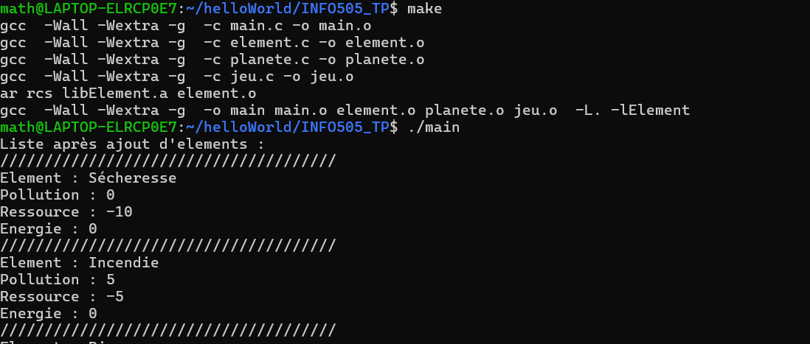
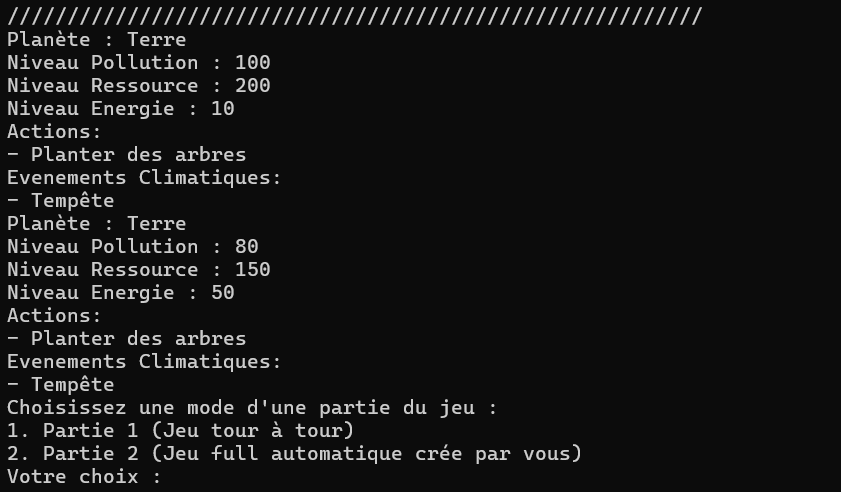
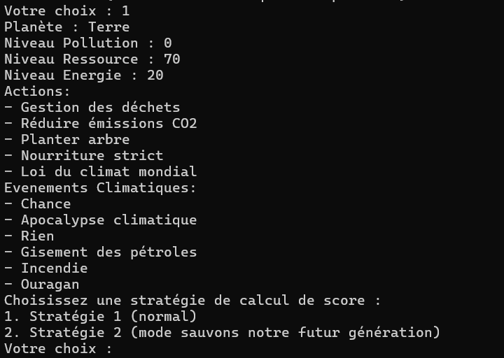
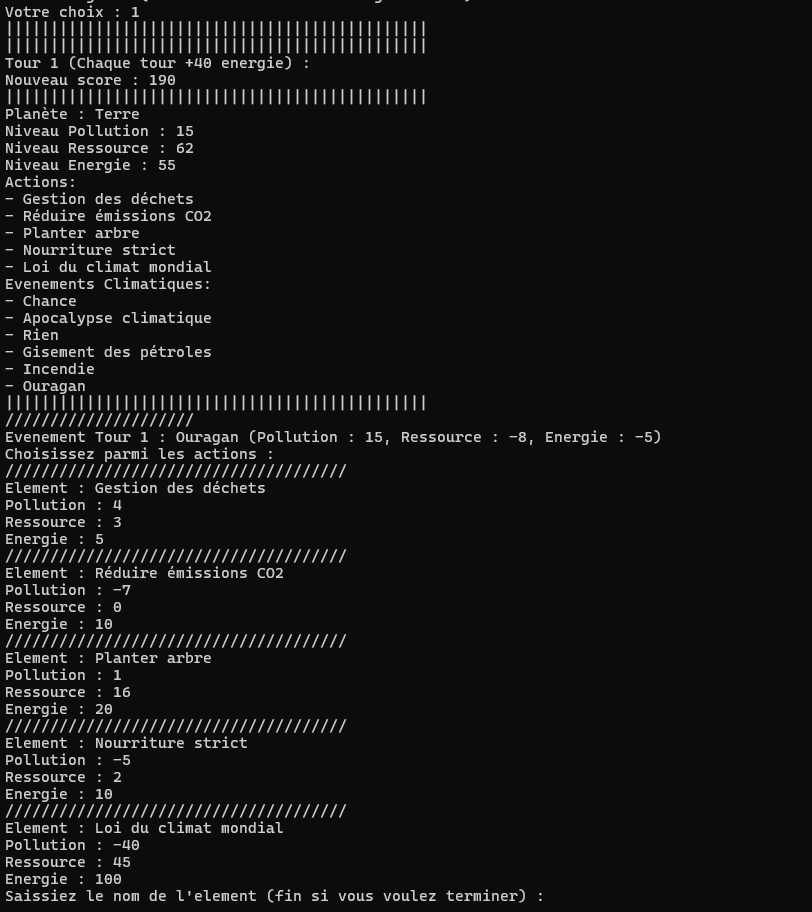
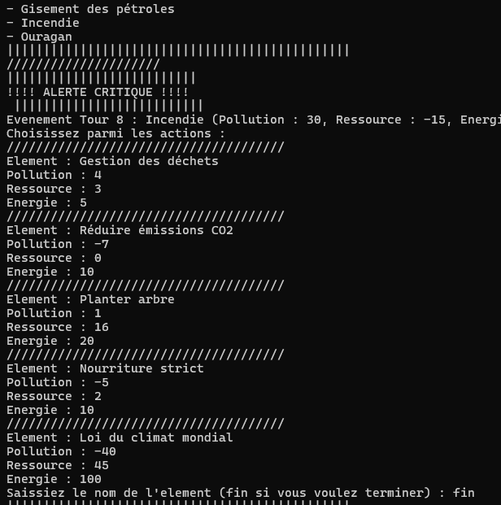
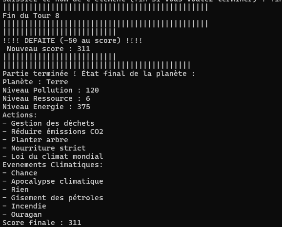
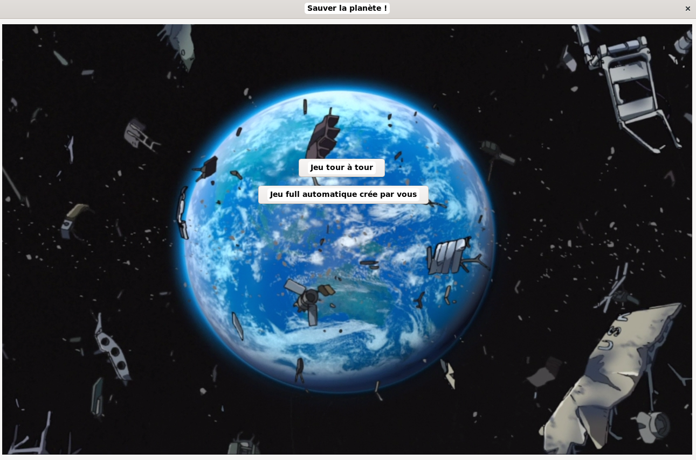
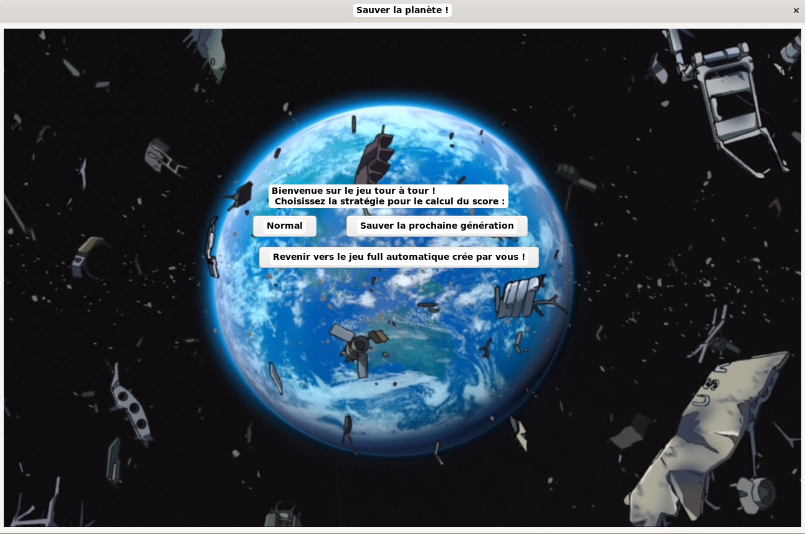
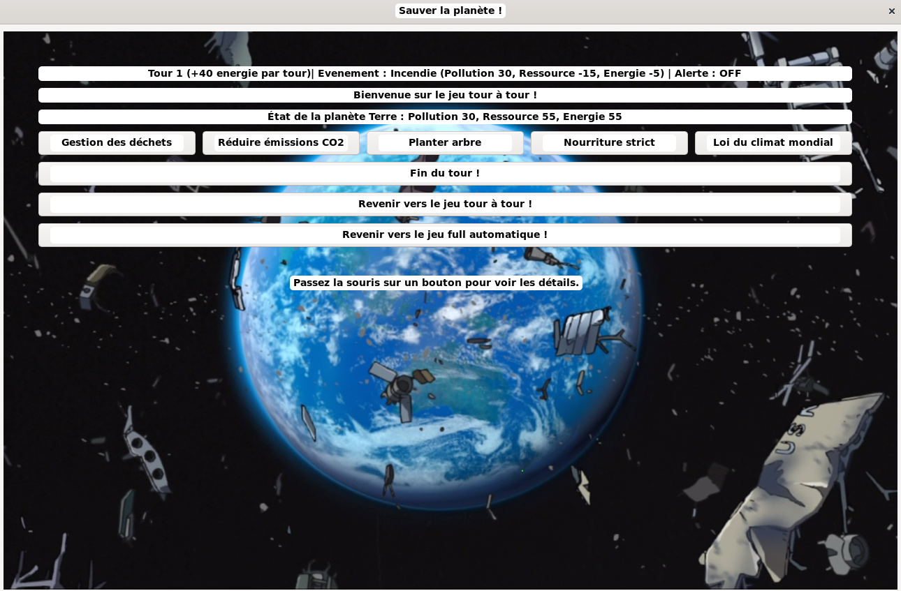
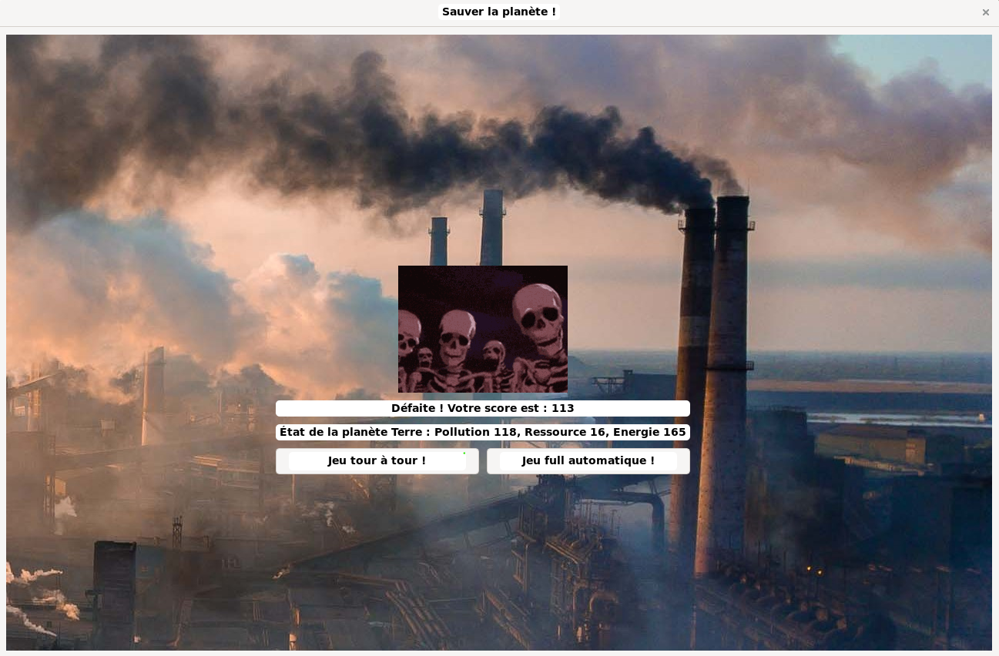

# INFO505_jeu_SauverLaPlanete

## Description

Ce projet est un jeu "Sauver la planète" en utilisant des actions et des événements. L'objectif est de créer une expérience de jeu interactive où un événement au hasard qui est généré à chaque tour pour faire avancer le jeu donc le choix d'un action a un impact ou non la planète. Les exemples et les tests sont faits sous Linux.

Le projet utilise :

- **Doxygen** pour générer la documentation (Voir le dossier `html` pour la documentation générée).
- **C** pour réaliser la programmation du jeu et des fonctionnalités associées.
- **Makefile** pour faciliter l'exécution des commandes et alléger le dossier des fichiers sources.

## Aspect important du TP

- **Choix de conception** : Nous avons opté pour des listes chaînées pour leur flexibilité en termes de taille et des tableaux dynamiques pour leur efficacité en accès direct.
- **Procédures utilisées** : Utilisation de pointeur, de malloc et de free pour la gestion dynamique de la mémoire, et mise en place de tests unitaires pour chaque fonction.
- **Spécificités du code** : Le code est structuré de manière modulaire avec des fichiers séparés pour les différentes parties du projet (structures de données, fonctions de manipulation, programme principal, makefile, doxyfile, GTK).

## Fonctionnalités

Le jeu offre plusieurs fonctionnalités principales, que voici :

### 0. Global

- Le jeu propose plusieurs paramètres du jeu dont il contient le choix des calculs de score, le choix des parties, le choix des actions et la création des actions et des événements.
- Son but du jeu est de ne pas dépasser la valeur de pollution de 100 et de tomber la valeur de ressource inférieur à 0. De plus, il faut atteindre la tour 10 pour gagner.

### 1. Jeu de tour à tour (Si vous choisissez cette partie)

- Le jeu a mis en place les actions et les événements par défaut
- Chaque joueur effectue un tour où il choisit une action ou plusieurs actions parmi plusieurs proposées.
- Le jeu gère l'événement qui se produit à chaque tour, influençant le déroulement du jeu.
- Le jeu se termine si le joueur a atteint le tour 10 ou la planète a atteint le niveau de pollution supérieur à 100 ou le niveau de ressource inférieur à 0

### 2. Actions et événements

- Le jeu propose une liste d'actions possibles et un événement choisi au hasard à chaque tour.
- Le joueur peut saisir le nom de l'action pour modifier l'état de la planète (par exemple, je choisi l'action "planter des arbres" qui augmente les ressources de la planète)
- L'événement au hasard apparait à chaque tour (par exemple, l'événement "gisement des pétroles" qui augmente la pollution et diminue les ressources mais donne des énergies)

### 3. Jeu automatique (Si vous choisissez cette partie)

- Le jeu est exécuté en mode automatique, où les actions et événements sont par l'utilisateur.
- Le joueur peut créer des actions et des événements
- La partie se déroule avec le choix des actions au hasard et automatiquement
- Chaque tour, vous aurez des pauses de 3 secondes afin de mieux visualiser la partie

### 4. Choix stratégique pour le calcul du score

- Si vous choisissez en mode normal, vous aurez comme formule :

```math
  score=100-niveauPollution-niveauRessource+niveauEnergie
```

- Si vous choisissez en mode "Protégez la génération future", vous aurez comme formule :

```math
  score=100-niveauPollution-niveauRessource+2*niveauEnergie
```

## Quelques guides pour l'installation GTK

### Sous Linux (Ubuntu/Debian) :

```
sudo apt update
sudo apt install libgtk-3-dev
```

### Sous Window :

Téléchargez et installez MSYS2 depuis https://www.msys2.org/.

```
pacman -S mingw-w64-x86_64-gtk3
```

Configurez votre environnement pour inclure les bibliothèques GTK.

### Sous MacOS :

Installez GTK via Homebrew :

```
brew install gtk+3
```

## Mode d'utilisation (SANS GTK)

### 1. Installation

Compilez le jeu à l'aide de `makefile`.

#### Sous Linux :

```
make nogtk
```

#### Sous Windows :

```

```

#### Sous MacOS :

```

```

### 2. Lancer le jeu

Pour lancer le jeu, exécutez :

#### Sous Linux :

```
./main
```

#### Sous Windows :

```

```

#### Sous MacOS :

```

```

### 3. Dépendances

Le jeu nécessite les outils suivants :

- **Make** pour la gestion de la compilation.
- **GCC** ou un autre compilateur C compatible pour générer les fichiers exécutables.

### 4. Exemple avec les images de test

#### a. Exécution :




#### b. Choix des parties :




#### c. Choix des stratégies de calcul :




#### d. Déroulement de la partie :




#### e. Alerte en cas proche de la défaite :




#### f. Fin de la partie :




### 5. Avant de terminer

Afin d'alléger le dossier, exécutez :

#### Sous Linux :

```
$ make clean
```

#### Sous Windows :

```

```

#### Sous MacOS :

```

```

## Mode d'utilisation (AVEC GTK)

### 1. Installation

Compilez le jeu à l'aide de `makefile`.

#### Sous Linux :

```
make gtk
```

#### Sous Windows :

```

```

#### Sous MacOS :

```

```

### 2. Lancer le jeu

Pour lancer le jeu, exécutez :

#### Sous Linux :

```
./main
```

#### Sous Windows :

```

```

#### Sous MacOS :

```

```

### 3. Dépendances

Le jeu nécessite les outils suivants :

- **Make** pour la gestion de la compilation.
- **GCC** ou un autre compilateur C compatible pour générer les fichiers exécutables.
- **GTK** pour la gestion de l'interface

### 4. Exemple avec les images de test

#### a. Choix des parties :




#### b. Choix des stratégies de calcul :




#### c. Déroulement de la partie :




#### d. Alerte en cas proche de la défaite (pollution):


#### e. Fin de la partie :




## Documentations utilisées

### Cours

- Cours Open : https://openclassrooms.com/fr/courses/19980-apprenez-a-programmer-en-c/19733-stockez-les-donnees-avec-les-listes-chainees
- Cours sur la programmation C en L2 (Philippe PERNELLE) et en L3 (Jean-Yves RAMEL)
- Doxygen : https://www.doxygen.nl/manual/docblocks.html https://fr.wikipedia.org/wiki/Doxygen
- Random in C : https://stackoverflow.com/questions/822323/how-to-generate-a-random-int-in-c
- Makefile : https://borntocode.fr/creer-un-makefile-pour-son-projet/
- Mon projet fait avant la séance : https://github.com/Mathieu-Lin/Huffman-Decodage/tree/main
- Aleatoire : https://koor.fr/C/cstdlib/rand.wp
- struct et typedef : https://public.iutenligne.net/informatique/algorithme-et-programmation/priou/LangageC/1813_utilisation_de_typedef_pour_dfinir_un_type_structur.html
- README : https://docs.github.com/en/get-started/writing-on-github/getting-started-with-writing-and-formatting-on-github/basic-writing-and-formatting-syntax
- GTK : https://www.gtk.org/

### Images

- spy-family-anya.gif → https://tenor.com/view/anya-spy-x-family-anya-forger-clapping-gif-11316739037330677138.
- ressource.jpg → https://upload.wikimedia.org/wikipedia/commons/thumb/8/8f/Lacanja_burn.JPG/1200px-Lacanja_burn.JPG
- planet.png → https://m.media-amazon.com/images/I/A1wN0v6xZpL.png
- defeat.jpg → https://assets.hongkiat.com/uploads/end-of-the-world-artworks/Chaos-of-2012.jpg
- pollution.jpg → https://cdn.shopify.com/s/files/1/0677/4059/8571/articles/AQL_AirPollutionClimateChange_Desk_25aeba1d-bc35-42cc-898b-e6ac098e881c.jpg?v=1705573944
- skeleton-berserk.gif → https://media.tenor.com/sJMBHgj4lXEAAAAM/berserk-berserk-skeleton.gif
- victory.jpg → https://Mathieu-Lin.github.io
- le reste → Captures d'écran des tests

### Documentations avancées

Linux :

```
doxygen Doxyfile
```

## Auteurs

- [Mathieu LIN ](https://mathieu-lin.github.io/) étudiant en L3 Informatique de l'Université Savoie Mont-Blanc (23/11/2024)
